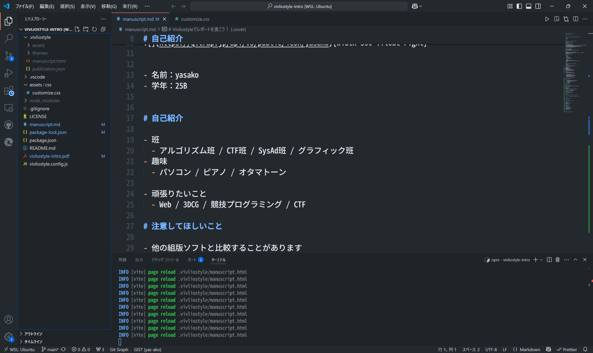

# Vivliostyleで<br>レポートを書こう！ {.cover}

## @yasako {.author-name}

<!-- {width=35} -->


# 自己紹介

<div class="horizontal-container">


- traQ ID「**yasako**」（25B）
- 班
  - アルゴリズム班 / CTF班 / SysAd班 /<br> グラフィック班
- 趣味
  - パソコン / ピアノ / オタマトーン
- 頑張りたいこと
  - Web / 3DCG / 競プロ / CTF


<!--  -->

{width=300}


</div>

# 注意してほしいこと

- 他の組版ソフトと比較することがあります
  - もちろん、他の組版ソフトの方が優れている点もあります。<span style="font-size: 20px">~~他の組版ソフトの方が優れていることが多いです~~ </span>
- Vivliostyleにそこまで詳しいわけではありないため、誤った情報が含まれるかもしれません
- 公式ドキュメントが最新バージョンに合わせて更新されていないことが多いです
- 自分用にカスタマイズするには、CSSの知識が必要です

# Vivliostyleの全体像{.chapter-heading}

# そもそもVivliostyleって？

- CSS組版のためのソフトウェア
  - HTML/CSSなどのWeb技術で組版をする
- traP Tech Book でも、PDFを出力する際に使用しているらしい...？

# 組版とは？

- 印刷物の紙面に文字や図などを配置し、レイアウトする
- フォント、文字サイズ、行間の広さ、1行の文字数、<br>改行位置、余白....　などについて考える
- 例えば...
  - 見出し：プロポーショナルフォント
  - 本文：等幅フォント

# Vivliostyleを用いた組版の流れ

- 入力ファイル
  - 原稿
    - Markdown
    - HTML
  - スタイルファイル
    - 公式・非公式テーマ
    - 自分で作ったCSSファイル

# Vivliostyleを用いた組版の流れ

- 出力ファイル
  - 一時ファイル
    - HTML (Markdownを入力した場合)
    - pablication.json （出力するドキュメントの情報をまとめたファイル）
  - 完成品
    - PDF
    - EPUB

# 内部の仕組み

（詳しくは公式ドキュメントやソースコードを参照のこと）

- Vivliostyle.js
- Vivliostyle CLI
<!-- - を定義したCSSファイルを元に、印刷可能なPDFファイルを生成する。 -->
  - PDF生成には、内部でChromiumを使用している

# Vivliostyleの何が良いの？

- Markdownで書ける
- Webの知識がそのまま使える
- 環境構築が楽
- TeXの数式が書ける
- ファイル内にハイパーリンクを貼れる
- 図表番号の参照ができる
- 見出しの番号を自由にカスタマイズできる
- ヘッダーとフッターを簡単のカスタマイズできる

# 有名な組版ソフトとの違い

- デメリット
    - ネットにある情報が少ない
    - 公式ドキュメントの更新が追いついていない

# bbb
- aaa
    - ファイル内にハイパーリンクを貼れる
    - 図表番号の参照ができる
    - 見出しの番号を自由にカスタマイズできる
    - ヘッダーとフッターを簡単のカスタマイズできる
- デメリット
    - ネットにある情報が少ない
    - 公式ドキュメントの更新が追いついていない


# 実際に使ってみる{.chapter-heading}

# インストール・環境構築

- 使い方
    - `npm create book`
      - CLIの質問に答えることで、プロジェクトを作成できる
      - テーマを選択（今回は academic を使用）
    - `npm run preview`
      - ブラウザでプレビューが可能
    - `npm run build`
        - PDFを生成する

# インストール・環境構築

（CLIの画像）

# サンプルを出力してみる

（VSCodeでマークダウンを開き、ブラウザでプレビューをを開いている画像）

# サンプルを出力してみる
（出力したPDFの画像）

# 図・表の挿入/参照
```md 画像の挿入
{.fig #figure-filename}
```

- {} の中に書いたclassやidを付与できる
- `figure-filename` は、一意であればなんでもOK

```md 画像の参照
[](#figure-filename){.fig-ref}
```
- マークダウンのリンクを挿入している

# 図・表の挿入/参照

```css
.fig-ref::after {
  content: "図" target-counter(attr(href url), vs-counter-fig);
}
```
- `vs-counter-fig` は Vivliostyle の base theme で定義されたカウンタ


# 数式の挿入

# ノンブル、柱、ヘッダー、フッター

# カウンタ変数の定義

# Running Head

# CSSのカスタマイズの例{.chapter-heading}

# base theme って？

# 枠を実装してみる
- ボーダー
- 見出し要素がある時は背景白の
- 箱を表示

# 数式番号を表示してみる

# 注釈
- 傍注を作る
- URLを注釈にしない

# 今後やってみたいこと

- マークダウン記法を独自に拡張
- tailwind CSSの導入
- 自作スタイルの見た目の改善
  - 余計な余白など

# ちなみに{.cover}


# 

<div style="text-align: center;">
このスライドもvivliostyleで作りました

<!-- {width=800 style="margin-inline: auto;"} -->


</div>