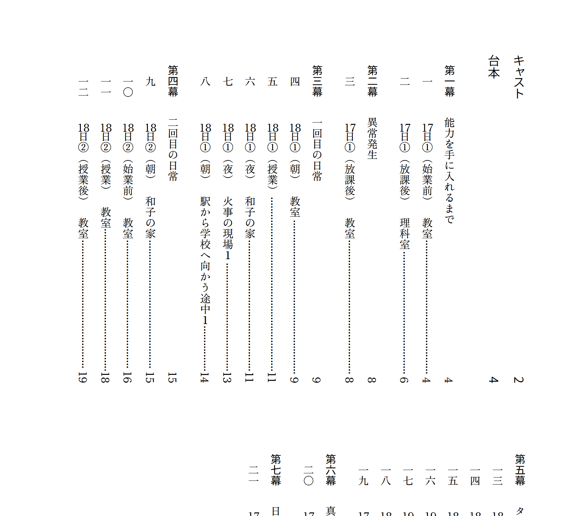
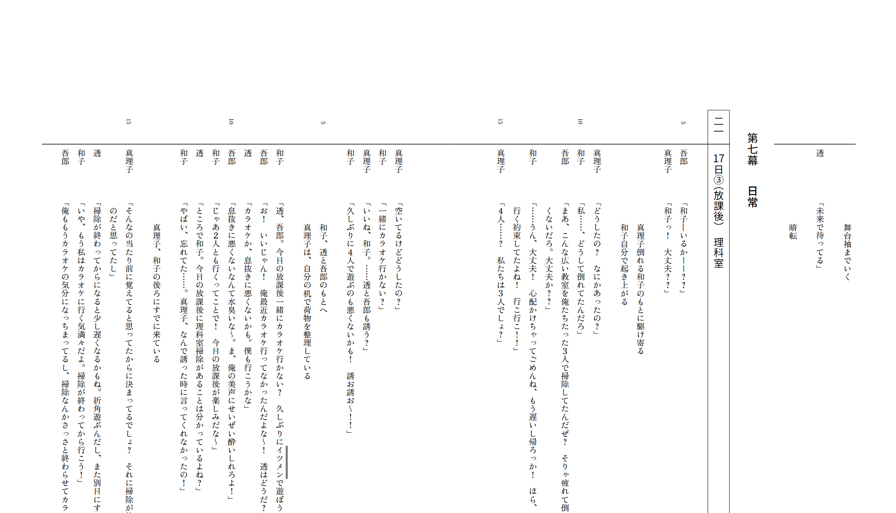
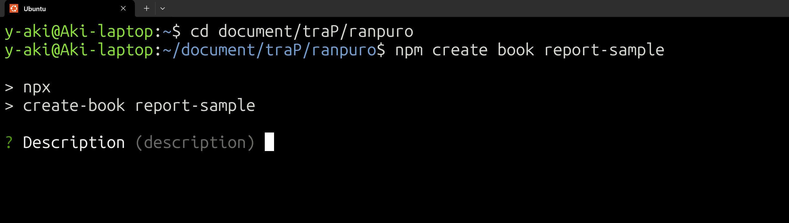

# Vivliostyle で<br>レポートを書こう！ {.cover}

## @yasako {.author-name}

<!-- {width=35} -->

# 自己紹介

<div class="horizontal-container">

- traQ ID「**yasako**」（25B）
- 所属している班
  - SysAd 班 / グラフィック班 / CTF 班 /<br>アルゴリズム班
- 趣味
  - パソコン / ピアノ / オタマトーン
- 頑張りたいこと
  - Web / 3DCG / CTF / 競プロ


<!-- {width=350} -->

</div>

# 注意してほしいこと

- 他の組版ソフトと比較することがあります
  - もちろん、他の組版ソフトの方が優れている点もあります。<span style="font-size: 20px">~~他の組版ソフトの方が優れていることが多いです~~ </span>
- Vivliostyle にそこまで詳しいわけではありないため、誤った情報が含まれるかもしれません。
- 公式ドキュメントが最新バージョンに合わせて更新されていないことが多いです。
- 自分用にカスタマイズするには、CSS の知識が必要です。

# Vivliostyle の全体像{.chapter-heading}

# そもそも Vivliostyle って？

- CSS 組版のためのソフトウェア
  - HTML/CSS などの Web 技術で組版をする
- traP Tech Book で、PDF を出力する際に使用している<br>らしい...？

# 組版とは？

- 印刷物の紙面に文字や図などを配置し、レイアウトする
- フォント、文字サイズ、行間の広さ、1 行の文字数、<br>改行位置、余白....　などについて考える
- 例えば...
  - 見出し：プロポーショナルフォント
  - 本文：等幅フォント

# 組版ソフトの例：Word

- 簡単
- WISIWG（What You See Is What You Get）
- お金がかかる
- 構造化された文章を書くのがつらい

# 組版ソフトの例：Word

{style="border:1px solid #bbb"}

<!-- <div class="vertical-container"> -->

<!--  -->

<!-- </div> -->

# 組版ソフトの例：Word

{style="border:1px solid #bbb"}

<!-- <div class="vertical-container"> -->

<!--  -->

<!-- </div> -->

# 組版ソフトの例：Indesign

- ほとんど使ったことがないので僕はわかりません
- 組版ソフトウェアのデファクトスタンダードらしい

# 組版ソフトの例：その他

- 朝刊太郎(使ったことはありません)
- 一太郎(使ったことはありません)
- ~~Microsoft Publisher~~
  - 26 年でサポートが切れるらしい

# 組版ソフトの例：？？？

<!--  -->


<!--  -->

# 組版ソフトの例：？？？


<!--  -->

# 組版ソフトの例：？？？


<!--  -->

# 組版ソフトの例：PowerPoint


<!--  -->

# 組版ソフトの例：$\mathrm \TeX$


<!--  -->

# Vivliostyle を用いた組版の流れ

- 入力ファイル
  - 原稿
    - Markdown
    - HTML
  - スタイルファイル
    - 公式・非公式テーマ
    - 自分で作った CSS ファイル

# Vivliostyle を用いた組版の流れ

- 出力ファイル
  - 一時ファイル
    - HTML (Markdown を入力した場合)
    - pablication.json （出力するドキュメントの情報をまとめたファイル）
  - 完成品
    - PDF
    - EPUB

# 内部の仕組み

（詳しくは公式ドキュメントやソースコードを参照のこと）

- Vivliostyle.js
- Vivliostyle CLI
  <!-- - を定義したCSSファイルを元に、印刷可能なPDFファイルを生成する。 -->
  - PDF 生成には、内部で Chromium を使用している

# Vivliostyle の良い点と欠点{.chapter-heading}

# Vivliostyle の良い点(1/3)

- 環境構築
  - とても簡単
- 執筆
  - Markdown で書ける
  - HTML も使える
  - Web の知識がそのまま使える
  - TeX の数式が書ける()

# Vivliostyle の良い点(2/3)

- ファイル内にリンクを貼れる
- 図表番号の参照ができる
- 見出しの番号を自由にカスタマイズできる
- ヘッダーとフッターを簡単のカスタマイズできる
- CSS について分からないことがあったとき、AI に聞いたら大体教えてくれる

# Vivliostyle の良い点(3/3)

- 開発が活発（次の例は Vivliostyle cli）
  - v9.0.0 のリリースは 2025/5/3
  - v9.2.0 のリリースは 2025/6/10
  - 約一か月の間に、最新版のリリースが 5 回あった

# Vivliostyle の良くない点

- ネットにある情報が少ない
  - ユーザーが少ないため
  - もっといろんな人に広めたい！
- 公式ドキュメントの更新が追いついていない
  - 開発が早いものの、コントリビューターが少ない
- 結局のところ試行錯誤は必要
  - どの組版ソフトも同じ？

# 実際に使ってみる{.chapter-heading}

# インストール・環境構築 1

- 使い方
  - `npm create book {プロジェクト名}`
    - CLI の質問に答えることで、プロジェクトを作成できる
    - テーマを選択（今回は academic を使用）
  - `npm run preview`
    - ブラウザでプレビューが可能
  - `npm run build`
    - PDF を生成する

# インストール・環境構築 2

- プロジェクトを作成
- メニューに従って選択



<!-- <div class="horizontal-container"> -->
  <!--  -->
<!-- </div> -->

# インストール・環境構築 3


# インストール・環境構築 4

- テーマを選択
  - 今回は `academic` を選択


# インストール・環境構築 5

- プロジェクトを生成中


# インストール・環境構築 6

- 準備完了


# インストール・環境構築 7

- VSCode でディレクトリを開く


# インストール・環境構築 8

`.vivliostyle` ディレクトリを除外する

```bash title=.gitignore
# Vivliostyle
.vivliostyle/*

# Logs
logs
*.log  # ...(略)
```

# インストール・環境構築 9

main ブランチではなく master ブランチになっているので注意


# サンプルを表示してみる

- `npm run preview` を実行すると、ブラウザでプレビューが表示される


<!-- # サンプルを出力してみる

（VSCodeでマークダウンを開き、ブラウザでプレビューをを開いている画像） -->

# CSS のカスタマイズの例{.chapter-heading}

# CSS ファイルの追加・読み込み

- 修正前
  - 最初に指定したテーマが設定されている

```js title=vivliostyle.config.js
module.exports = {
  // ...省略...
  theme: "@vivliostyle/theme-academic@^2.0.0",
  // ...省略...
};
```

# CSS ファイルの追加・読み込み

- 修正後

```js title=vivliostyle.config.js
module.exports = {
  // ...省略...
  theme: ["@vivliostyle/theme-academic@^2.0.0", "assets/style.css"],
  // ...省略...
};
```

# テーマのカスタマイズについて

- まずは次の記事を6本全部読もう  
  <https://gihyo.jp/list/group/Vivliostyleが拓くCSS組版の可能性>


# カスタマイズの仕組み

- Vivliostyle のテーマは、CSS 変数を用いてカスタマイズする
- テーマのソースコードを自分で読まなければならないことがある

```css title=style.css
  --vs--h1-font-size: 1.7em;
  --vs--h2-font-size: 1.7em;
  --vs--h3-font-size: 1.5em;
```

# フォント

- base theme に定義されているCSS変数を上書きすることで、フォントを変更できる

```css title=style.css
/* Google Fontsをインポートした上で */
:root {
  --vs--heading-font-family: "Noto Sans JP";
  --vs--heading-font-weight: 700;
}
```

# レポートを書こう！{.chapter-heading}

# 必要な機能
- 図・表の挿入/参照
- 数式の挿入
- ノンブル、柱、ヘッダー、フッター
- 章のカウンタ

# 出来上がったもの

{style="border:3px solid #bbb"}

# 出来上がったもの

{style="border:3px solid #bbb"}

# 出来上がったもの

{style="border:3px solid #bbb"}

# 出来上がったもの

{style="border:3px solid #bbb"}

# 図・表の挿入/参照

```md title=sample.md
### 図の挿入
{.fig #figure-filename}

上の [](#figure-filename){.fig-ref} は、....(略)
```

- class や id を、{} の中に書いて設定できる
- `figure-filename` は、一意であればなんでも OK
- マークダウンのリンクを挿入している

# 図・表の挿入/参照

- `fig-ref` は、図の参照を実現するためのクラス
  - テーマファイルにはおそらく含まれていないため、自分で書く必要がある。先ほどのサイトで紹介されている。
```css title=style.css
.fig-ref::after {
  content: "図" target-counter(attr(href url), vs-counter-fig);
}
```

- `vs-counter-fig` は Vivliostyle の base theme で定義されたカウンタ

# 数式の挿入

- MathJax を使って数式を挿入できる

```tex
$$
\int_{a}^{b} f(x) \, dx = F(b) - F(a)
$$
```

<div class="vertical-container" style="border: 3px solid #bbb;">

$$
\int_{a}^{b} f(x) \, dx = F(b) - F(a)
$$

</div>

# 紙面の余白

- ページの余白には、ページ番号や現在の章のタイトルなどを表示する機能
- 一番理解に時間がかかった
- あとで補足する

# 紙面の余白


# カウンタ変数の定義

- この機能は、普通のブラウザでも使える
- 見出しの番号を実装する際は、見出しではなく見出しをh組んだ `section` 要素に対してカウンタを設定することに注意
- 時間がないので割愛


# 枠を実装してみる

- Markdown のみで実装するのは難しい  
  div 要素で囲んで実現
- 見出し要素がある時は、見出しの部分の背景を白にする

{style="border:3px solid #bbb"}


# 今後やってみたいこと

- マークダウン記法を独自に拡張
- tailwind CSS の導入
- 自作スタイルの見た目の改善
  - 余計な余白など
- 書籍の組版
  - 目次の自動生成
  - 章ごとに異なる位置のツメを付ける

# ちなみに{.cover}

#

<div class="vertical-container">
<strong style="text-align: center;">このスライドもvivliostyleで作りました</strong>

<!-- {width=800 style="margin-inline: auto;"} -->


</div>

# 余白の説明の続き

このスライドの右上に表示されている「Vivliostyleでレポートを書こう！」は、次のコードにより表示されている。

```css title=style.css
:root {
  --vs-page--mbox-content-top-right: env(pub-title);
}
```

- env() は、Vivliostyle によって実装された関数

# @page について

- 特定のページだけスタイルを変えることができる
  - 背景色を変える / 余白の内容を変える ... など
- いまだによくわかっていないけれど、なんかうまくいった
- このスライドの章のタイトルページは、ページ番号のみ表示されるようになっている

たとえば、 `# こんなかんじに{.chapter-heading}` 書くと

# こんなかんじに {.chapter-heading}

なります

# 今回のスライドに関連する資料

- https://github.com/yas-ako/my-vivliostyle-report-template
  - Vivliostyle のレポートテンプレート を作ってみた
  - 実際にレポートを提出する際に使用した
- https://github.com/yas-ako/vivliostyle-intro
  - このスライドのソースコード
  - 気になるところがあったらなんでも質問してください
    - 分かる範囲でこたえます

# 参考資料(1/2)

- Vivliostyle <https://vivliostyle.org>
- Vivliostyle Themes <https://github.com/vivliostyle/themes#readme>
- Vivliostyle CLI <https://github.com/vivliostyle/vivliostyle-cli#readme>

# 参考資料(2/2)

- [Vivliostyleが拓くCSS組版の可能性](https://gihyo.jp/list/group/Vivliostyleが拓くCSS組版の可能性)
- <https://github.com/vivliostyle/vivliostyle-cli>
- 書籍：『Web技術で「本」が作れる CSS組版Viliostyle入門』 (2023/5/24 発行 リブロワークス著)

# ご清聴ありがとうございました！！

- 発表の内容
  - [1. Vivliostyle の全体像](#vivliostyle-の全体像)
  - [2. Vivliostyle の良い点と欠点](#vivliostyle-の良い点と欠点)
  - [3. 実際に使ってみる](#実際に使ってみる)
  - [4. CSS のカスタマイズの例](#css-のカスタマイズの例)
  - [5. レポートを書こう！](#レポートを書こう)

<span style="font-size: 30px">緑色の文字は、ファイル内のリンクです。上のページ番号はもちろん自動で挿入されています</span>